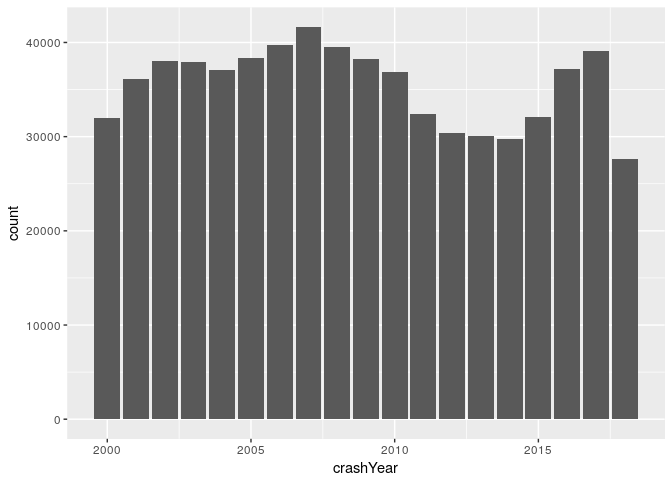
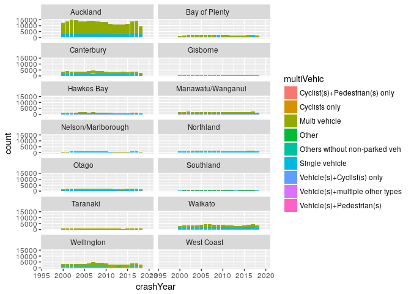
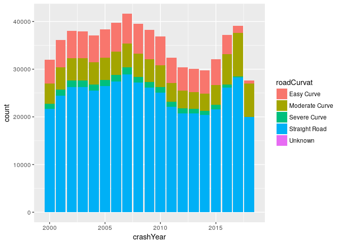

This shows some simple RStudio plotting using the NZTA Crash Analysis System dataset.

Download the latest dataset from [NZTA OpenData Crash Analysis System data](https://opendata-nzta.opendata.arcgis.com/datasets/crash-analysis-system-cas-data) (select *Download* then *Spreadsheet*) and place the CSV in this directory (filename should be `Crash_Analysis_System_CAS_data.csv`).

Load the CSV data and the `ggplot2` library. (If this package isn't already installed, [install the package](https://www.r-bloggers.com/installing-r-packages/).)


```r
library(ggplot2)
cas <- read.csv("Crash_Analysis_System_CAS_data.csv", stringsAsFactors=FALSE)
```

Let's plot the sum of crash incidents by year.


```r
ggplot(cas, aes(x=crashYear)) + geom_bar()
```

<!-- -->

A more complicated `ggplot` might separate into regions and then fill based on the vehicles involved in the crash incident.


```r
ggplot(cas, aes(x=crashYear, fill=multiVehic)) + geom_bar() + facet_wrap(~regionDesc, ncol = 2)
```

<!-- -->

There's lots more data available to explore, eg the type of road curvature at the location of the crash incident.


```r
ggplot(cas, aes(x=crashYear, fill=roadCurvat)) + geom_bar()
```

<!-- -->

Have fun!
